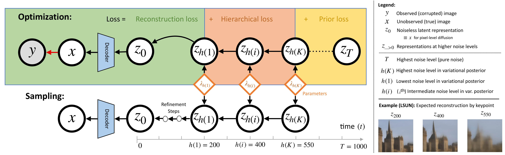

# VIPaint: Image Inpainting with Pre-Trained Diffusion Models via Variational Inference
[](https://jimin-heo.github.io/vipaint/)
[](https://arxiv.org/abs/2411.18929)


Reference implementation of VIPaint on top of the Stable Diffusion 3.5 reference codebase. VIPaint is a hierarchical variational inference algorithm that fits a non-Gaussian Markov approximation of the true diffusion posterior, producing diverse high-quality inpaintings even for large masked regions on state-of-the-art text-conditioned latent diffusion models. The same framework also applies to other inverse problems such as deblurring and super-resolution.

The underlying SD3.5 inference stack (text encoders OpenAI CLIP-L/14, OpenCLIP bigG, Google T5-XXL; the 16-channel VAE Decoder; and the core MM-DiT) is unchanged from the upstream reference implementation.

Note: this repo is intended as a research reference for VIPaint. For plain SD3.5/SD3 inference without VIPaint, the original `sd3_infer.py` entry point still works.



*Optimization (top): The hierarchical approximate posterior of VIPaint is defined over a coarse sequence of intermediate latent steps, or keypoints, between h(K) and h(1). During optimization, the variational parameters λ defining the posterior at these sparse times are fit via a prior loss on times above h(K), a hierarchical loss defined across K keypoints, and a reconstruction loss estimated using a sample-based one-step approximation of p_θ(x | z_{h(1)}). After a single variational optimization, multiple samples may be drawn via gradient-based stochastic refinement.*


## Download

Download the following models from HuggingFace into `models` directory:
1. [Stability AI SD3.5 Large Turbo](https://huggingface.co/stabilityai/stable-diffusion-3.5-large-turbo/blob/main/sd3.5_large_turbo.safetensors) or [Stability AI SD3.5 Large](https://huggingface.co/stabilityai/stable-diffusion-3.5-large/blob/main/sd3.5_large.safetensors)
2. [OpenAI CLIP-L](https://huggingface.co/stabilityai/stable-diffusion-3.5-large/blob/main/text_encoders/clip_l.safetensors)
3. [OpenCLIP bigG](https://huggingface.co/stabilityai/stable-diffusion-3.5-large/blob/main/text_encoders/clip_g.safetensors)
4. [Google T5-XXL](https://huggingface.co/stabilityai/stable-diffusion-3.5-large/blob/main/text_encoders/t5xxl_fp16.safetensors)

VIPaint additionally expects inpainting data under `dataset/`:
- input images, prompt files, and either a single mask file or a directory of per-image masks named `mask_{i:06d}.png`.
- The bundled experiments use `dataset/synthetic_data`, `dataset/synthetic_simple_data`, `dataset/random_masks`, `dataset/rectangular_mask_1024.png`, `dataset/synthetic_prompt.txt`, and `dataset/synthetic_simple_prompt.txt`.


## Install

```sh
# conda env setting
conda env create -f environment.yml
conda activate vipaint
```

## Run

```sh
# Inpaint with the default experiment (synthetic, SD3.5 Large Turbo, 1024 px)
python3 run.py
# Use the simple synthetic dataset
python3 run.py --experiment synthetic_simple --outdir results/simple
# Override any of the experiment paths from the command line
python3 run.py --image_dir path/to/images --mask_path path/to/mask.png --prompt_file path/to/prompts.txt
```

Outputs are written to `<outdir>/<i:02d>/` per image (intermediate samples, loss/tau curves, masked input, prompt + config). Final variational and DPS samples are also saved at the top of `<outdir>/`. To change the run output directory, pass `--outdir <my_outdir>`.


## File Guide

- `run.py` - entry point for VIPaint, loads data and runs the sampler over a dataset
- `VIPaint.py` - `VIPaintSampler`: variational optimization (`optimize`) followed by DPS refinement (`sample`)
- `lpips/` - masked LPIPS used in the DPS data-consistency term
- `sd3_infer.py` - upstream entry point for plain SD3 generation, review this for basic usage of the diffusion model
- `sd3_impls.py` - contains the wrapper around the MMDiTX and the VAE
- `other_impls.py` - contains the CLIP models, the T5 model, and some utilities
- `mmditx.py` - contains the core of the MMDiT-X itself
- folder `dataset` for VIPaint inputs (download or supply separately): images, masks, and per-line prompt files
- folder `models` with the following files (download separately):
    - `clip_l.safetensors` (OpenAI CLIP-L, same as SDXL/SD3, can grab a public copy)
    - `clip_g.safetensors` (openclip bigG, same as SDXL/SD3, can grab a public copy)
    - `t5xxl.safetensors` (google T5-v1.1-XXL, can grab a public copy)
    - `sd3.5_large.safetensors` or `sd3.5_large_turbo.safetensors` or `sd3.5_medium.safetensors` (or `sd3_medium.safetensors`)

## Code Origin

This repository is built on top of the [Stability AI SD3.5 reference implementation](https://github.com/Stability-AI/sd3.5). The underlying code originates from:
- Stability AI internal research code repository (MM-DiT)
- Public Stability AI repositories (eg VAE)
- Some unique code for this reference repo written by Alex Goodwin and Vikram Voleti for Stability AI
- Some code from ComfyUI internal Stability implementation of SD3 (for some code corrections and handlers)
- HuggingFace and upstream providers (for sections of CLIP/T5 code)
- The VIPaint sampler (`VIPaint.py`) and runner (`run.py`) are additions to the upstream SD3.5 reference codebase.

## Citation

```bibtex
@misc{agarwal2026vipaintimageinpaintingpretrained,
      title={VIPaint: Image Inpainting with Pre-Trained Diffusion Models via Variational Inference}, 
      author={Sakshi Agarwal and Gabriel Hope and Jimin Heo and Erik B. Sudderth},
      year={2026},
      eprint={2411.18929},
      archivePrefix={arXiv},
      primaryClass={cs.CV},
      url={https://arxiv.org/abs/2411.18929}, 
}
```

## Legal

Check the LICENSE-CODE file.

### Note

Some code in `other_impls` originates from HuggingFace and is subject to [the HuggingFace Transformers Apache2 License](https://github.com/huggingface/transformers/blob/main/LICENSE)
